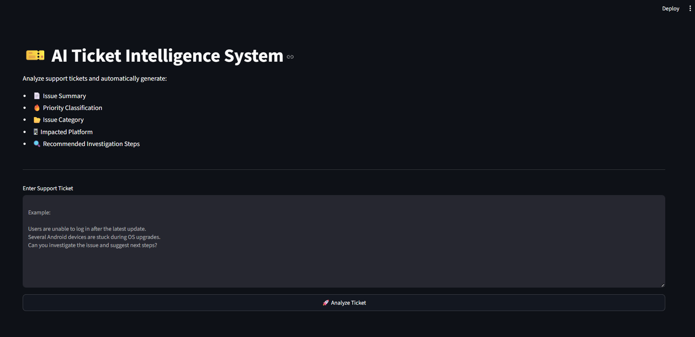
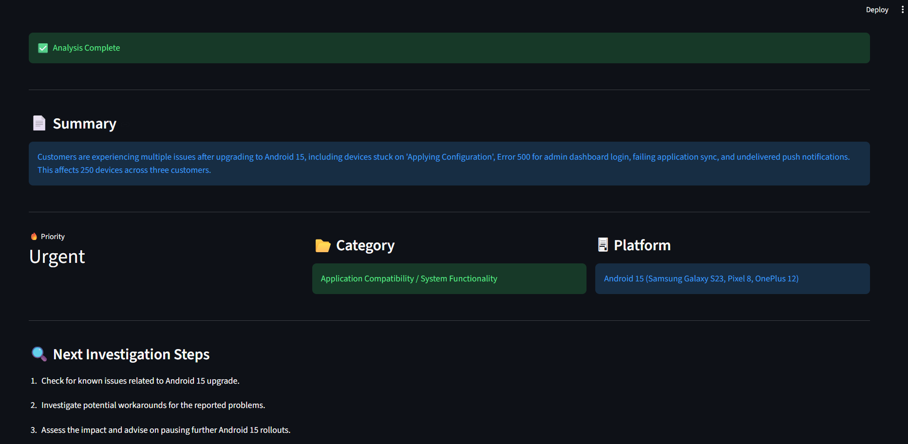

# AI Ticket Intelligence System

## Overview

AI Ticket Intelligence System is a GenAI-powered support ticket analysis platform built using Python, Streamlit, and Google's Gemini API.

The system analyzes unstructured support tickets and automatically extracts actionable insights including issue summaries, priority levels, categories, impacted platforms, and recommended investigation steps.

The goal is to help support engineers quickly understand customer issues and reduce the time required for ticket triage and investigation.

---

## Features

### AI-Powered Ticket Analysis

* Automatic Ticket Summarization
* Priority Classification
* Issue Categorization
* Platform Identification
* Investigation Step Recommendations

### Intelligent Processing

* Structured JSON Response Handling
* Prompt-Based Information Extraction
* Automated Ticket Intelligence Generation

### User Interface

* Interactive Streamlit Dashboard
* Real-Time Analysis
* Clean and Responsive Layout

---

## Tech Stack

### Backend

* Python

### AI

* Google Gemini API

### Frontend

* Streamlit

### Concepts Used

* Object-Oriented Programming (OOP)
* JSON Processing
* API Integration
* Prompt Engineering
* Modular Application Design

---

## Architecture

```text
User
  ↓
Streamlit Frontend
  ↓
Ticket Processor
  ↓
Gemini API
  ↓
Structured JSON Output
  ↓
Analysis Dashboard
```

---

## Sample Workflow

1. User submits a support ticket.
2. Ticket is sent to Gemini for analysis.
3. AI extracts:

   * Summary
   * Priority
   * Category
   * Platform
   * Investigation Steps
4. Results are displayed in the dashboard.
5. Structured ticket intelligence is generated for support teams.

---

## Example Input

```text
Several Android devices are stuck during OS updates.

Users are unable to access the dashboard and receive Error 500.

The issue is impacting approximately 250 devices across multiple customers.

Is there a workaround available?
```

---

## Example Output

```json
{
  "summary": "Android devices are failing during OS updates and users are unable to access the dashboard due to Error 500.",
  "priority": "High",
  "category": "Technical Support",
  "platform": "Android",
  "next_steps": [
    "Collect device logs",
    "Verify dashboard error details",
    "Review recent deployment changes"
  ]
}
```

---

## Screenshots

### Dashboard



### Analysis Result



---

## Installation

### Clone Repository

```bash
git clone https://github.com/AshutoshSaraff/AI-Ticket-Intelligence-System.git
```

### Navigate to Project

```bash
cd AI-Ticket-Intelligence-System
```

### Create Virtual Environment

```bash
python -m venv .venv
```

### Activate Virtual Environment

Windows:

```bash
.venv\Scripts\activate
```

### Install Dependencies

```bash
pip install -r requirements.txt
```

### Configure Environment Variables

Create a `.env` file in the project root:

```env
GOOGLE_API_KEY=YOUR_GEMINI_API_KEY
```

### Run Application

```bash
streamlit run frontend.py
```

---

## Project Structure

```text
AI-Ticket-Intelligence-System/

├── ai_client.py
├── ticket_processer.py
├── file_manager.py
├── frontend.py
├── README.md
├── requirements.txt
├── screenshots/
│   ├── dashboard.png
│   └── analysis-result.png
└── .env
```

---

## Future Enhancements

* Similar Incident Search
* Knowledge Base Integration
* Vector Database Support
* RAG-Based Recommendations
* Multi-Ticket Analytics Dashboard
* Support Agent Copilot Features

---

## Author

Ashutosh Saraf
